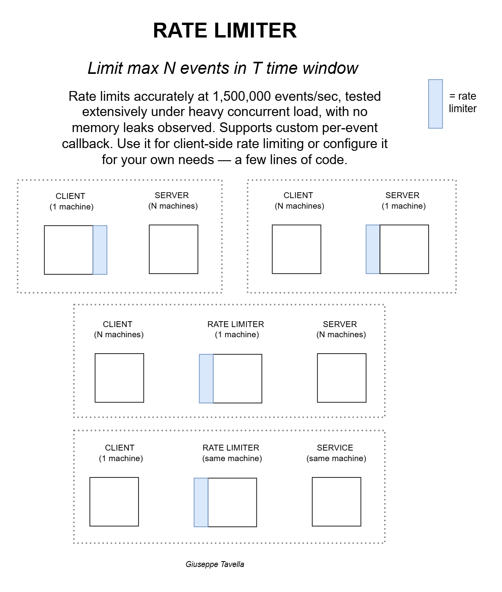
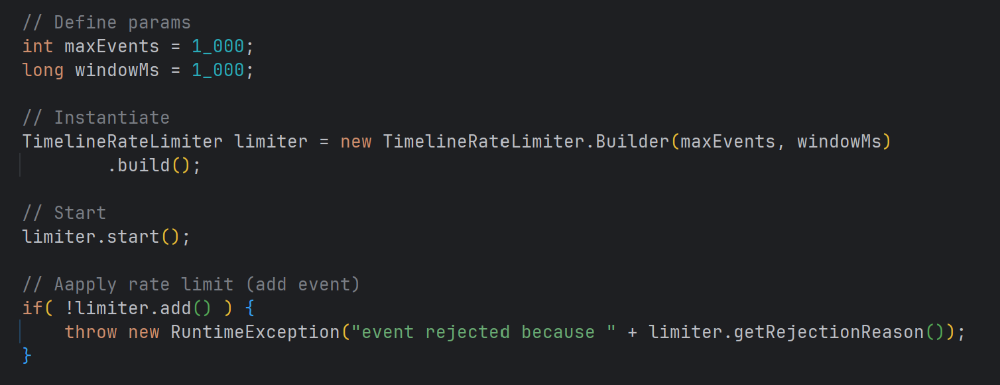

# Rate Limiter: Algorithm

This is the Rate Limiter Algorithm, which is part of my [Rate Limiter Project](https://github.com/tave8/rate-limiter). 

This library started from a personal problem; An Email Sending API would allow max 5 emails sent per second. This solution is thought to be used for ***client-side rate limiting***. It's when you use a third-party service and know their request limit and you should limit the requests yourself before you hit that 429 HTTP status code.

<p align="center">
  
</p>

Here's how easy it is to create a rate limiter and apply the rate limiting logic.

<p align="center">
  
</p>

Scenarios:
- You have 1 web server. You can rate limit directly in-memory, in your web server. The client *is* your web server.
- You have more web servers. You must use a rate limiter, through which you requests are proxied. The client are *all* of your web servers. This is because you have more web servers
  so the rate limiting cannot be applied to anyone of them but to another web server (that you control) that actually does the rate limiting.

What it offers:
- Implementation-independent. You can use the same library to rate limit third-party services (so HTTP requests), to rate limit in your web server memory (if you only have 1 machine acting as the client) or use another web server to act as the rate limiter (if you have more web servers acting as the client).
- Minimal API. You apply rate limiting with 1 method, `add()`. 


The goal is to provide you with a Rate Limiter algorithm that is efficient, easy to use and that you can start using right now in your project.

It does not require Spring, however if you use Spring it'll be even easier because this library leverages the convention of using a singleton for each service (a bean) which maps perfectly to how the library is thought to be used: ***1 service instance : 1 rate limiter instance***. 


## The problem

This is the simple problem to solve: 

> Limit how many *events* are allowed to be *added* during a time *window*.

However, this problem must be rephrased, including the actual constraints and usability requirements:

> ...and do so in an efficient manner that can scale to hundreds of thousands of events per second without requiring maintenance, in a way such that memory and time do not grow linearly with number of events; providing an easy to use and highly configurable, generic interface that can be used to fit a variety of use cases; providing support for custom burst protection; all of this with good thread-safety guarantees.

## Known limitations

- This is an in-memory solution, so it does not survive power loss (it's not persistent). It implies that long time windows are not suitable, because the longer the window, the more likely it is it can be interrupted midway and thus lose history.  
- By in-memory we mean memory on a single machine, so this is not distributed. So you cannot have more machines acting as a rate limiter, rate limiting the same service. But you can definitely have many clients, many services and many rate limiters, however the memory is local to the individual rate limiter machine, so more rate limiter machines will not know about each other and thus cannot rate limit the same service.
- There's no support for client-level rate limiting, in the sense that there's no track of which client sent how many requests. The rate limiting is service-wide, meaning you only define how many max events are allowed to be added during a time window for a specific service. Because of this, the library is thought to be used for client-side rate limiting, meaning that the client is responsible for not sending more than 20 requests per second to the AI API, say. 
- The library was designed to be generic, it does not care about any particular use case and it has no knowledge of its environment. So of course you'll have to detail what "adding an event" means to your use case. You only get the rate limiting logic, how you make it work or where it's located is up to you.
- It is not suitable for sub-millisecond precision. For simplicity, the millisecond was chosen as standard time unit across the entire project. So when you see time inputs such as `window`, what is always implied is milliseconds.


## Installation 

The library will be built from this repo with JitPack. Go in your `pom.xml` and place these tags.

This tag must be placed in any place as a *direct child* of the `project` tag.

```xml
<repositories>
    <repository>
        <id>jitpack.io</id>
        <url>https://jitpack.io</url>
    </repository>
</repositories>
```

This tag must be placed, of course, as a *direct child* of the `dependencies` tag.

```xml
<dependency>
    <groupId>com.github.tave8</groupId>
    <artifactId>rate-limiter-algo</artifactId>
    <version>v1.0.3</version>  <!-- to pin the version, you can use a tag in the github repo -->
</dependency>
```


## How to use

A Rate Limiter is, as you might have guessed, an interface. We must instantiate an implementation of a Rate Limiter, to start using it.

```java
// Example rate limiting max 100 events per second
int maxEvents = 100;
long window = 1000;

RateLimiter limiter1 = new TimelineRateLimiter.Builder(maxEvents, window).build();
RateLimiter limiter2 = new TimelineRateLimiter.Builder(maxEvents, window).build();

limiter1.add();
limiter2.add();
```

What you need to know is that rate limiting is local to each instance, so the history of `limiter1` is different from the history of `limiter2`. Each instance is separated from any other instance, and has its own "history" of events. Different instances, different rate limiting. This design choice makes the following relationship possible, and it's the pattern you'll see in the entire project: 

> 1 service instance : 1 rate limiter instance

Simply put, events that need to be rate-limited and are part of the same service must use the same instance.

```java
RateLimiter emailLimiter = new TimelineRateLimiter.Builder(maxEvents, window).build(); // Its own history
RateLimiter aiLimiter = new TimelineRateLimiter.Builder(maxEvents, window).build(); // Its own history
RateLimiter pdfLimiter = new TimelineRateLimiter.Builder(maxEvents, window).build(); // Its own history
```


### Implementation-specific usage

Each rate limiter implementation offers different features. However, because of the much better performance of the `TimelineRateLimiter`, you are advised to use instead of the `HistoryRateLimiter`. 

#### Event Filtering (TimelineRateLimiter)

Timeline Manager supports custom event filtering logic. This allows you to create custom burst protection logic, for example. As the name suggests, the filter is applied for each new event, only after the condition "is there enough space for a new event" evaluates to true. Here's how easy it is to create your custom event filterer.

```java
// Define custom event filterer
EventFilterer fil = (t) -> {
       if(t.isBeforeWindowThreshold(.8)) {  // Is < 80% of window?
           return t.isBeforeEventThreshold(.95); // If < 95% of max events, can add. Else reject.
       }
       return t.isBeforeEventThreshold(.97); // If < 97% of window, can add. Else reject.
  };
};

RateLimiter rateLimiter = new TimelineManager(maxEvents, window, fil); 
```

#### Fast-forwarding Time (HistoryRateLimiter)

Initially, I had to wait for tests to finish because physical time passed is the whole point of testing a rate limiter. But that wasn't sustainable.

Now, I can simulate the wait without actually waiting, all the while still being able to wait physically correctly, and now I can run tests in milliseconds. How?

History Queue supports a "fast-forwarding time" functionality that allows for running tests without actually waiting. It is essentially about making time pass logically without having to wait physically, and because each History Queue instance has its own "concept of time", each successive call to the same instance will produce the expected result with the correct timing, even with actual time passed both preceding or following artificial time added. Note: At the moment the `after()` method has public visibility, but it should only be used in testing.

The following examples are logically equivalent. 

Waiting for physical time only:

```java
RateLimiter rateLimiter = new HistoryQueue(maxEvents, window);

rateLimiter.add();

Thread.sleep(950);

rateLimiter.add();
            .add();

Thread.sleep(1050);

rateLimiter.add();

Thread.sleep(1000);

rateLimiter.add();
```

Using a mix of artificial time and physical time:


```java
RateLimiter rateLimiter = new HistoryQueue(maxEvents, window);

// All these calls are happening pretty much instantly, so at most 
// a few nano/micro/milliseconds have actually passed
rateLimiter.add()         
            .after(950)
            .add()
            .add()
            .after(1050)
            .add();

// Imagine some actual time has passed, for example with:
Thread.sleep(1000);

// When adding this event (if it's not rejected) the History Queue instance 
// cannot tell the difference between actual physical time passed (1000ms)
// and logical time we have artificially added. So adding a new event
// at this point in time will be like having waited for "950ms + 1050ms + 1000ms",
// of which the first two are artificial and the third is physical time. 
// Again, this is local to the History Queue instance.
rateLimiter.add();
```


## Definition

Let's better understand the problem:

> Limit how many *events* are allowed to be *added* during a time *window*.

This is the most generic definition I could come up with, here's what it implies:

- An event can be anything, it can be a task, a request etc.

- Adding an event can signify submitting a task, executing a task, when the request is received etc. By design, the algorithm does not know or care about business-specific semantics, task or request lifecyle or things like that. Thus, "adding an event" is the most agnostic concept I could come up with, so you are not tied to use cases and can instead fit your own.

- Window, also known as time window, is the amount of time during which more than the maximum events that you define, cannot occur. More specifically, for a rate limiter, not more than the maximum events that you define can occur between the window start and now. A window is not the same as a period; A window is a fixed amount but it must be calculated from now. So the window start is `window_start = now - window`. On the other hand, you could calculate a period by multiplying some point in time with a factor. For example, multiplying something like `today_midnight + (period * 1)` gives you today at midnight plus the period. `today_midnight + (period * 2)` gives you today at midnight plus the the double of that period, and so on.

Two implementations for a rate limiter are offered: 

- History Queue. This was the first implementation, but it suffers from poor performance because it has to literally remember past history. It may be more accurate.
- Timeline Manager. Second implementation, the most performant.  


## Complexity analysis

Let: 
- E = number of max events 
- N = number of total events over time 
- T = number of timelines

| Implementation   | Dimension | Method  | Complexity                    | Motivation                               |
|:-----------------|:----------|:--------|:------------------------------|:-----------------------------------------|
| History Queue    | Space     | `add()` | O(E) at best, O(N) on average | Stores timestamp for each new event.     |
| History Queue    | Time      | `add()` | O(E) at worst                 | Requires iterating over past timestamps. |
| Timeline Manager | Space     | `add()` | O(1)                          | Only a counter is updated.               |
| Timeline Manager | Time      | `add()` | O(T)                          | Iterate through timelines.               |


Because the number of timelines is and should be very low (1-5) and known upfront, maybe we could approximate O(T) to O(1).


## Reasoning & Challenges

### Defining the real problem

At first I thought that the solution consisted in splitting the time into periods, and have something continuously update the "current start of period".

If I know the current start of period and the time now, then I could keep track of how many tasks have been submitted in this time delta.

So something had to keep the the "current start of period" updated. This something was a thread that would wake up at a custom interval and would keep the "current start of period" in sync.

So let's say you start the task limiter now to rate limit 5 tasks per second, then a thread wakes up every second and keeps updating the "current start of period"

which is simply `startOfPeriod += period`.

This solution was not viable for at least these reasons:
- Waste of resources. Waking up a thread just to keep the "current start of period" in sync. CPU cycles wasted and a OS context switch just to keep
  the current start of period updated. If the tasks to be rate limited are infrequent, resources are wasted anyways.
- Not scalable, not secure and not performant. A "time updater thread per task limiter" model as well as a thread waking up at a custom interval (such each second) suffers from trust issues,
  in the sense that the user directly controls how frequently the thread wakes up.
- Reliance on OS hoping that context switch would occur timely and without much delay. Uncertainty about how to deal with task submission if task submission
  occurred in the the time it takes between the actual end of the current period and when the thread wakes up to update the current period.

**But most importantly, that wasn't even what the problem was all about!**

I thought the problem was splitting the time into chunks, then I asked myself, why am I structuring time? It feels like I'm inventing time.

I'm wasting resources just to keep track of what is the current start of period, but don't I already know what second is now and what is the previous second?

So I thought, maybe I can ground the original start time to be a floored number, for example instead of taking 12h:32m:34s, let's just start from 12h:32m:00s.


This approach entails that in an 1 second "artificial" period, I can have 5 tasks submitted. Then this current artificial start of period gets updated,

and immediately after that a task is submitted. The time difference between this newly submitted task and the last submitted task is only 5 milliseconds away.

And altogether, the 6 tasks have been submitted in less than a second. So I realized, this cannot happen, I need to reformulate the problem as follows:

```
INITIAL PROBLEM: allow max N tasks in T period

REFORMULATED PROBLEM: the sum of the time deltas of the most recent N tasks is <= T period,
    where time delta = time of new task submission - time of last task submission
```

But this approach forced me to think about time deltas, keeping track of them etc.

So I said myself, okay this makes more sense, but what do I actually need for the problem? The number of tasks or the deltas?

And eventually realized that the tasks count in the T period was what I actually needed.

This means that the problem was not about structuring time or even knowing a current start of period.

The problem revolved around how many tasks have been submitted in the T period, regardless of whether that period is part of a "time structure" like

the difference between this second and the previous second, etc.

What matters is knowing whether the last N tasks have been submitted in the T period, which is another way of stating the most up-to-date reformulation of the problem:

`the number of tasks submitted between now and now - T period must be <= N max tasks`

### Waiting without waiting

In life, either you change yourself or you change the environment (or maybe there's nothing to change).

The problem is that waiting for tests to finish is not ideal.

A task limiter should limit the number of tasks in a given time window.

However that shouldn't mean waiting real time just to test that it works.

So back to our metaphor; Either you make the thread wait (and you wait for it), or you simulate the waiting.

Either you wait real time just so time can move forward, or you make that time move forward yourself.

It's on this intuition that a solution was created to simulate waiting without actually waiting.

Each history queue has its own concept of time and can be easily modified.


### Decoupling timelines from threads

The second implementation is called Timeline and uses this concept of splitting the time window in proportional fractions so that "within-window but cross-window time intervals" are caught sooner and with more likelihood.

A more formal definition is something like:

```
Let t0, t1, t2, t3 be monotonically increasing time points, such that their deltas is the window. In other words, t1 - t0 = t2 - t1 = t3 - t2 = window.

The rate limiter should limit max N events within this window, so the invariant is: count events in window <= max events.

This makes sense, but the problem is that the window is a moving target. In fact, a valid window would be [t0 + d, t1 + d], with d < window, so d is an arbitrary small (or big) number such that adding it to the time point of the start window would give us back a time point that overlaps one of the previously "rigid" windows.

The problem is, how do we make this window move. The thing is, if we do, we gain maximum reactivity in terms of how fast we detect event overflow in overlapping cross-window intervals, but this requires us to keep track of the exact time of each event. And this means space and time complexity increase linearly with max events, at best. At worst we're storing many more time points.

The problem is, we cannot have this approach with an infinite sliding window, infinite in the sense "like a real number in math, there are infinitely many numbers between a number and any other number".

This problem requires us then to relax granularity and consider some kind of approximation. Approximation not in event count nor in window; instead in how cross-window intervals are taken into account and thus increasing likelihood and speed of when cross-window intervals are about to produce event overflow.


BEFORE (storing all event time points):

|---------------|---------------|---------------
 |---------------|---------------|---------------
  |---------------|---------------|--------------- 
   |---------------|---------------|---------------
   .
   .
       |---------------|---------------|---------------
       . 
       .
            |---------------|---------------|---------------    
            .
            .
               |---------------|---------------|---------------    


AFTER (timelines approximate):

0 |---------------|---------------|---------------
1      |---------------|---------------|---------------
2           |---------------|---------------|---------------
  
```

The whole reason why I brought this up is that while shaping the concept of a timeline, there was a coupling between timelines and threads, specifically: 1 timeline : 1 scheduled thread. The mechanism provided by scheduled threads was that of delaying tasks at delays such that this overlapping was achieved and cross-window event overflow could be detected with more likelihood or quicker.

The goal now is to decouple a timeline from a thread. Ideally, each rate limiter instance should either only start 1 scheduled thread, or possibly have some kind of scheduling thread per app and then pass that down to the rate limiter instance. This would bring the space complexity from the current near-constant space to literally constant space, right? 

Evolution:
1. Current situation. Timelines and scheduled threads are strongly coupled. This costs O(T) space per rate limiter instance, where T = number of timelines and the space occupied is that of the scheduled threads.
2. A first improvement is having 1 scheduled thread per rate limiter instance, bringing space complexity to O(1) per instance.
3. Another improvement is having the scheduled thread passed down from outside, maybe 1 scheduled thread per app, maybe just dedicated for rate limiting. 


### Implementation: Timeline Manager 

The Rate Limiter implementation gives up determinism and loosens up events count accuracy, to gain in efficiency, speed and scalability.

Rate limiting accuracy, which comes down to events count accuracy in the time window, depends on the number of timelines, which is configurable. It is also affected by thread context switching. 

The number of timelines is, effectively, like a CPU clock. You can also see it as a heartbeat frequency; The faster it beats, the quicker, more likely and more precisely you'll know and detect what just happened since last heartbeat. The heartbeat beats on average at `window * nTimelines` speed, which is why increasing the number of timelines increases the heartbeat speed (up to a point), which in turn increases events count accuracy, which means detecting events overflow faster.

It's not always possible to have instant feedback on whether the max events have been achieved in the window at the exact moment the overflow has been reached.

By loosening up on instant reactivity and accuracy, we achieve great efficiency, scalability and speed: The algorithm has constant space complexity on all operations and O(K) time complexity per new request, where K = number of timelines, which we have control over, is very low (1-5) and known upfront. 

Simply put, it is possible that very quick burts of requests not be detected, if they occur in less than the time window time and the timing is such that no timeline was awakened to reset its events count and check if any events overflow occurred. 


## More (unstructured)

Content that I have not yet structured. Like javadocs that were too long.


MORE:

    /**
     * Get the now of the history queue. 
     * This abstraction allows to fake what now means;
     * We can fake waiting for events, without actually waiting.
     * - When <code>cumulativeDelay = 0</code>, the now of this history queue
     *   correspondes to the actual now (no faking).
     * - When <code>cumulativeDelay > 0</code>, the now of this history queue
     *   has been "fast forwarded" by <code>cumulativeDelay</code>
     * 
     * There's no logical difference between:
     * 
     * <pre>
     * NORMAL WAIT
     *  1. Add event
     *  2. Wait 1 second
     *  3. Add event (this is the current now)
     * 
     * ARTIFICIAL WAIT
     *  1. Add event, Fake wait 1 second, Add event (this is the current now)
     * </pre>
     * 
     * So long as the (artificial) now saved in the event is the (actual) now 
     * plus the cumulative delay at this actual point in time. And this is 
     * precisely the illusion we're creating.
     * 
     * @return
     */
    private long getNow() {
        /**
         * This single line is the whole idea behind fast forwarding time;
         * The now of the history queue is simply the actual now plus 
         * whatever cumulative delay at the actual now.
         */
        return util.getNow() + cumulativeDelay;
    }

MORE:

    /**
     * Add a delay to the cumulative delay of this history queue.
     * This is the core mechanism of "faking the now" by fast forwarding
     * time with the goal to mimic waiting. When adding an event, 
     * the event is passed the now of the history queue, not the actual now.
     * This decouples the "now of the history queue" from the "actual now",
     * allowing each history queue to have its own concept of time.
     * Both the actual now and the artificial now (history queue) 
     * are abstracted away from the user.
     * 
     * The outcome: We can wait without actually waiting.
     * 
     * @param delay
     * @return
     */


#### The initial delay and time buffer

    /**
     * Calculate the time buffer, which is simply the number of milliseconds 
     * representing some amount of time that is proportional to the window.
     *
     * <br>
     * It's used in a formula like <code>windowStart + lastBuffer</code>
     * to effectively locate the start of the last buffer in the current period.
     *
     * <br><br>
     * Some useful cases:
     * <ul>
     *     <li>A factor of 0 returns 0.</li>
     *     <li>A factor of <code>nTimelines-1</code> is used to locate 
     *          the start of the last buffer in the current period.  
     *     <li>A factor of <code>nTimelines</code> is equivalent to end of the window.</li>
     * </ul>
     *
     *
     * @return
     */


    /**
     * Core idea of the Timeline implementation.
     * By using the initial delay of the timeline as a permanent shift in the sense of time,
     * each timeline effectively has its own start window.
     *
     * The initial delay of the timeline (and thus, of the scheduler) 
     * is <code>(window / nTimelines) * i</code> and the reasoning behind it is as follows.
     *
     * Let Timeline 0 be the first timeline. Then Timeline 0 will start
     * with an initial delay of 0. Let Timeline 1 be the second timeline.
     * Then Timeline 1 will start within the window, but in after a fraction of time 
     * has passed. This fraction of time is evenly distributed, so to speak.
     * Concretely, this fraction of time is simply <code>window / nTimelines</code>
     * so that the initial delay of each timeline is an exact fraction of the window.
     * However, to make assigning the initial delay each timeline an automatic process,
     * we need to schedule each timeline to start after the initial delay of the previous timeline.
     * Which is the formula becomes <code>(window / nTimelines) * i</code>, where i is the i-th timeline.
     *
     * <br><br>
     *
     * Many timelines starting at different delays effectively increases precision.
     * With this implementation, it's almost impossible to get an exact guarantee 
     * that the given max number of events is respected. Instead, precision 
     * is loosened up to allow for speed.
     *
     * Precision can be increased by increasing the number of timelines.
     * However, because of the nature of threads, there's no exact guarantee 
     * on timing. Because of the overall pragmatic nature of this implementation, 
     * and because it gives up accuracy to gain in efficiency, optimal results
     * should be assessed empirically. For example, by increasing the number of timelines,
     * it's possible there are no increases in accuracy.
     *
     *
     *
     * <pre>
     *    1 timeline: 
     *
     *      |--------------|--------------|--------------|--------------
     *
     *
     *    2 timelines:
     *
     *      |--------------|--------------|--------------|--------------
     *              |--------------|--------------|--------------|--------------
     *
     *
     *     3 timelines:
     *
     *      |--------------|--------------|--------------|--------------
     *            |--------------|--------------|--------------|--------------
     *                 |--------------|--------------|--------------|--------------    
     *
     *     4 timelines:
     *
     *      |--------------|--------------|--------------|--------------
     *          |--------------|--------------|--------------|--------------
     *              |--------------|--------------|--------------|--------------   
     *                  |--------------|--------------|--------------|--------------
     *
     *
     *     5 timelines:
     *
     *      |--------------|--------------|--------------|--------------
     *         |--------------|--------------|--------------|--------------
     *            |--------------|--------------|--------------|--------------   
     *               |--------------|--------------|--------------|--------------
     *                  |--------------|--------------|--------------|--------------    
     *
     * </pre>
     *
     * @param timelineIdx
     * @return
     */


    /**
     * Is this the last time buffer in the window?
     *
     * Here's an example with 3 Timelines. The asterisks represent the 
     * time in the last buffer in each window in each timeline.
     *
     * <pre>
     *     ------------------------------------------------------> time
     *
     *                *****          *****          *****
     *     |--------------|--------------|--------------|
     *                     *****          *****          *****
     *          |--------------|--------------|--------------|
     *                          *****          *****          *****
     *               |--------------|--------------|--------------|
     * </pre>
     *
     * This can be used to create custom rate limiting logic such as: 
     * "If a new event is trying to be added in the last buffer period, 
     * and 95% of events have already been added from the start of this period
     * (in percentage to the max events allowed in the window), then disallow insertion
     * of new events before you even get to the exact max events (we assume you'll get there, 
     * so preventive back-off)".
     *
     * @return
     */
    // public boolean isThisLastBuffer() {
    //     var startLastBuffer = windowStart + manager.calcLastBuffer();
    //     return getNow() >= startLastBuffer;
    // }


    /**
     * Calculate the last time buffer of the window.
     * This is useful for knowing whether we are "towards the end"
     * of a window.
     *
     * <pre>
     *     ------------------------------------------------------> time
     *
     *                 |--- buffer start
     *    window start |           
     *     |           v
     *     v           *****          *****          *****
     *     |--------------|--------------|--------------|     timeline
     *
     *     |----------|
     *      last buffer 
     *
     * </pre>
     *
     * @return a number, in milliseconds, that indicates the buffer (almost like a left padding)
     *          that can be added to the window start, to get the buffer start
     */
    // public long calcLastBuffer() {
    //     return calcBuffer(nTimelines-1);
    // }


### More challenges


I started thinking how I could create such a solution that is generic, easy to configure and not invasive. There was no way I would pollute the email sending logic with rate limiting logic.

Rate limiting logic should not care that it's rate limiting sending emails. And sending emails should not care or know that it's being rate limited. They must be decoupled, the rate limiting must be easy to plug in, easy to plug out.


And then more questions came up: Do I send the requests to the rate limiter? Do I queue them? Should the rate limiter retry the request if it was rejected? And should the user keep waiting?

And then more questions as to the performance: Should I log all timestamps? But this wouldn't scale.

And then more questions as to the developer experience: I want this to be as little code as possible. It must be a minimal API. The developer might want more customization or to get started quickly, and I should allow both options.

And then more questions as to what party would do the actual rate limiting: Well, I'm using an Email API, so I'm the user of a service. This means that I have no control over the service. I could place

This means that the Rate Limiter is when you use the service, not when you provide the service. When you are the service provider, you want to do more than just rate limit your service, you may also want to rate limit per client.

And what when I have more machines that all use the same third-party service? Then the in-memory per-machine solution won't work.
